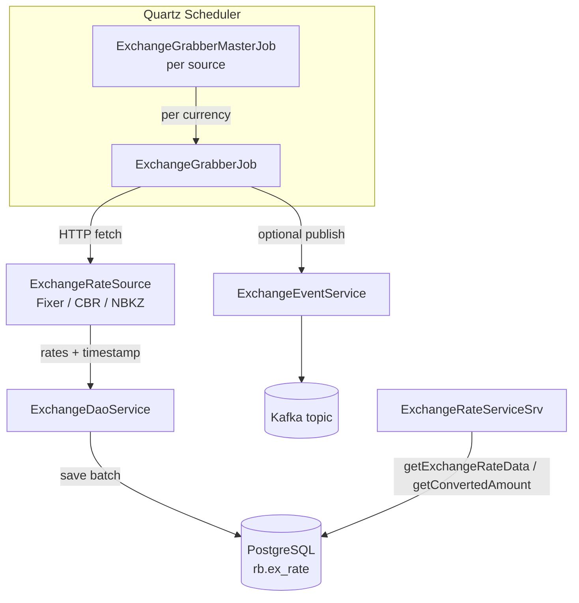

# rate-boss

Rate-boss periodically pulls exchange rates from external sources, stores them in the database, and optionally publishes rate events to Kafka. It also exposes API endpoints to read the latest or historical rates and to convert amounts by timestamp.

Supported sources today: Fixer, CBR, NBKZ.

## Service flow (actual)

## Quartz execution

For each configured source:
- `ExchangeGrabberMasterJob` reads the list of base currencies from `rates.*Job.currencies`.
- It spawns `ExchangeGrabberJob` per currency.
- Each `ExchangeGrabberJob` calls the respective `ExchangeRateSource`, saves the rates, and (for some sources) emits Kafka events.
