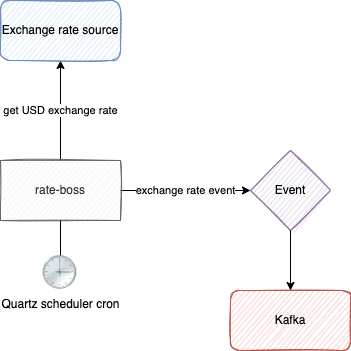
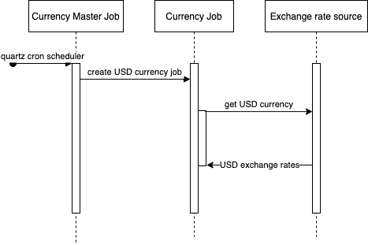

# rate-boss![]

The essence of the service is quite simple. It collects exchange rate data from some source and stores it in a kafka topic

Currency exchange rate is collected according to a specific schedule cron, which we specify in the configuration file.
We use quartz cluster mode to support the work of our service in multi node mode.

Quartz execute like this. First, we have `ExchangeGrabberMasterJob` its job is to take the list of currencies from the configuration
and create jobs `ExchangeGrabberJob` for each currency. `ExchangeGrabberJob` makes a request to a certain source of exchange rates
and send the received rates into kafka topic.
